This is a tool created as a "mod takeover" for Twitch streams, but at the most basic level it is two webpages.  One is and editor that can add text and images as well as drawing, the other is just a display for everything.

For the editor, here's your basic layout:
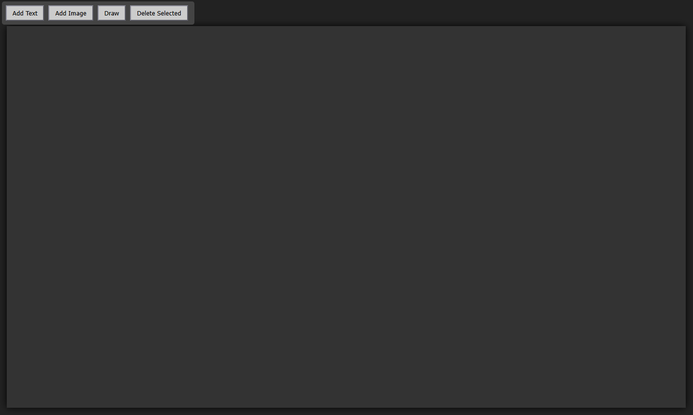

The light grey box is your canvas.  Whatever you do there will be done on the display page, or "on-stream".  You'll also notice you have 4 buttons:
- Add Text
- Add Image
- Draw
- Delete Selected

## Add Text
When you add text to the stream, a panel will display on the top right corner where you can enter the text you want and change the color.
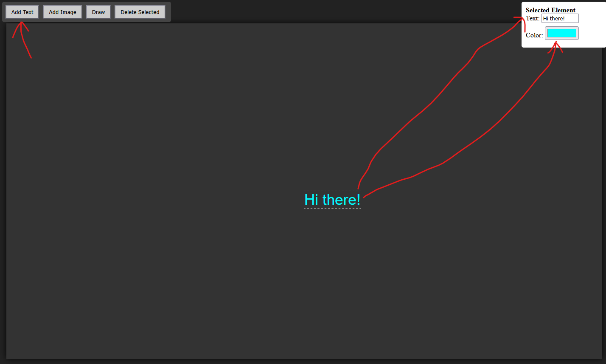

If there is already text on the canvas, you can click on that text to edit these properties at any time.  When you select something on the canvas, it will have a dashed outline around it, making it easy to tell what you are playing with.  You can then move that item around by holding down the mouse button and moving it.

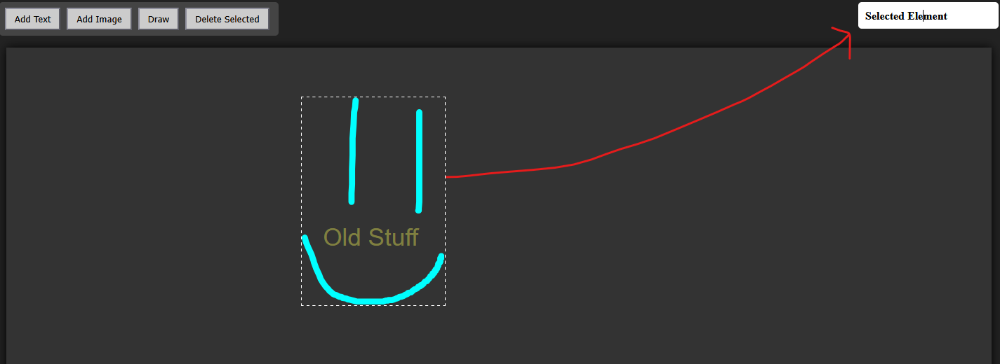

If you wish to remove an item from the canvas, simply select it and click the "Delete Selected" button, or you can hit the `DELETE` key on your keyboard.

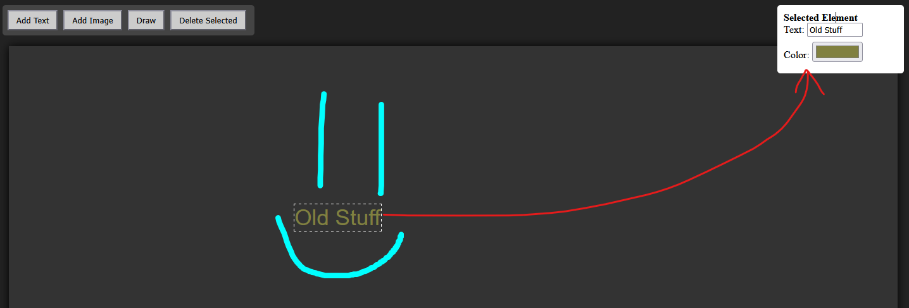
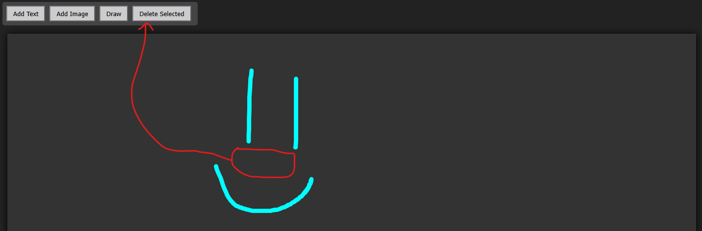

## Add Image
This button allows you to add an image to the canvas.  You will need the URL of the image you want to use, which you can usually get by right-clicking an image and selecting "Copy Image URL" or something close to that wording.  Animated images (typically saved as `.gif` files) are supported
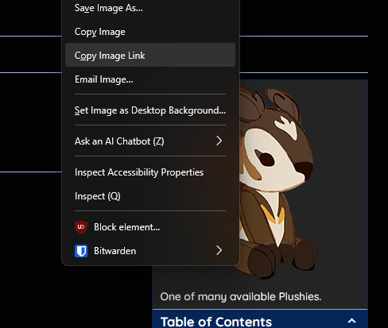

Once you have the URL for the picture you want to add, paste it into the text box for "Image URL:" and hit `Enter`
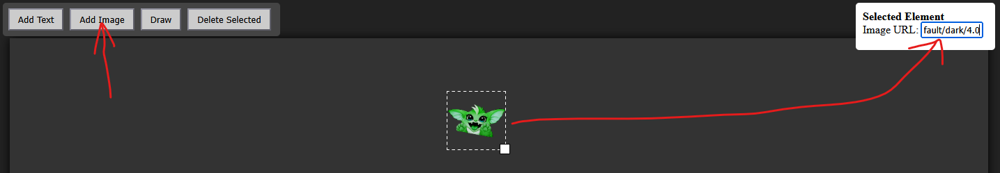

You can resize images by dragging the little white square in the bottom right corner of the dashed outline around the picture.
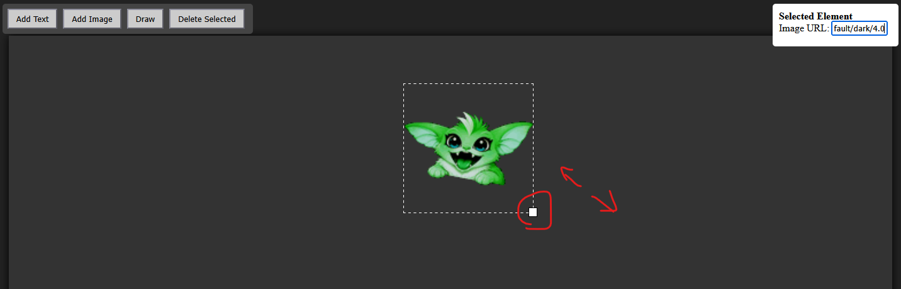

## Draw
When you click the "Draw" button, you will enter "Draw Mode".  The Draw button will change to a "Finish" button and an "Undo" button will also show up next to it.  Your mouse will become a little plus sign ( `+` ) as well (inside the canvas only).
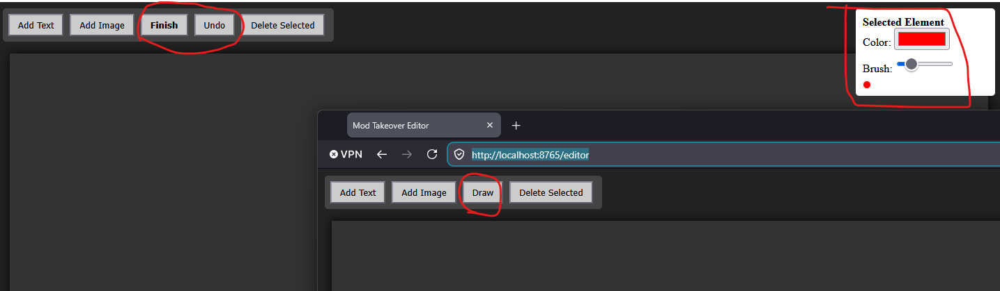

In the poperties panel in the top right corner, you will have a color picker for "Color" and a slider for "Brush" size, along with a preview of the brush.
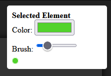
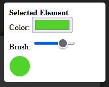

Drawing is a easy as holding the left button on your mouse to start the brushstroke and releasing it when you finish the stroke.  If you made a mistake and need to remove the last brush stroke, click the "Undo" button.  This can be done multiple times to remove multiple strokes, with the most recent one always being the stroke removed.  When you finish all your strokes and your work of art is complete, click the "Finish" button and it will show up on stream.
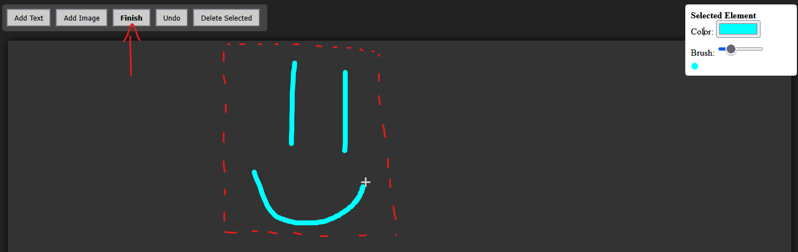

*Note: You cannot edit your drawing once you click "Finish"